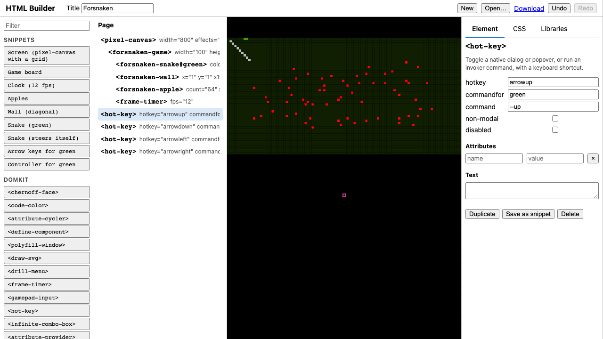

# HTML Builder

A drag-and-drop editor for pages built from HTML elements, including
custom elements (web components) from any library. There's no build step:
serve the folder and open it.



**[Open it](https://johnhenry.github.io/htmlbuilder/)** ·
**[Open the snake game project](https://johnhenry.github.io/htmlbuilder/?project=./projects/forsnaken.html)**

## Using it

- **Palette** (left): snippets saved in the project, every custom element
  its libraries describe, and common HTML. Drag an entry onto the page
  outline, or click it to add it inside the selected element.
- **Page** (outline): the page as HTML, one tag per line: start tags with
  their attributes, children indented, then the end tag (an element without
  children is one line; `` and other void elements have no end tag).
  Drops land where the line between rows suggests: the upper half of a
  start tag goes before the element and the lower half inside it, first;
  the upper half of an end tag goes inside, last, and the lower half after
  it. On a one-line element, the top edge is before, the middle inside,
  and the bottom edge after. Drag a tag (either one) to move its element. <kbd>Delete</kbd> removes the selection, <kbd>⌘D</kbd>/<kbd>Ctrl+D</kbd>
  duplicates it, <kbd>⌘Z</kbd>/<kbd>Ctrl+Z</kbd> undoes.
- **Preview** (middle): the page, running, in a sandboxed frame.
  <kbd>Alt</kbd>/<kbd>Option</kbd>-click an element in it to select it.
- **Element** panel: the selected element's attributes, and its text (or,
  for an element with children, the text before and after them). For a
  custom element whose library has a manifest, each documented attribute
  gets the right control (a checkbox for booleans, a number field, a menu
  for a fixed set of values), with its description as a tooltip.
- **CSS** panel: the page's styles, and the rules that match the selected
  element (click one to find it).
- **Snippets** panel: rename, edit, or delete the palette's snippets.
- **Libraries** panel: the libraries the page loads; components defined
  straight from a module URL (a tag, the URL, and which export); and
  whether the preview may load from this page's origin.

## A project is a web page

Download gives you the page itself, and that file is also the project:
open it again (Open…, or drop it on the editor) to keep editing.

```html
<head>
  <meta name="htmlbuilder-manifest" content="domkit https://…/custom-elements.json">
  <script type="module" src="https://…/frame-timer/global.mjs" data-library="domkit"></script>
  <template data-snippet="Clock (12 fps)"><frame-timer fps="12"></frame-timer></template>
  <style>…</style>
</head>
<body>…what you built…</body>
```

- **Libraries** are module `<script>`s (grouped by `data-library`), plus
  an optional [Custom Elements Manifest](https://github.com/webcomponents/custom-elements-manifest)
  that tells the editor what each element is and which attributes it takes.
- **Snippets** are `<template data-snippet>`s: ready-made markup for the
  palette. Select an element and use *Save as snippet* to add one.
- **Components from a URL** are module scripts that import the export and
  call `customElements.define()` (marked `data-define`, so the editor can
  read them back).
- The editor saves as you go (in this browser), and `?project=URL` opens
  a project from a URL.

## How it works

| File | What it does |
|---|---|
| [`src/project.mjs`](src/project.mjs) | The project: parsing and writing the page, paths to elements, edits with undo |
| [`src/outline.mjs`](src/outline.mjs) | The page outline as HTML, and where drops land |
| [`src/palette.mjs`](src/palette.mjs) | The palette, from snippets, manifests, and [`html-basics.mjs`](src/html-basics.mjs) |
| [`src/manifests.mjs`](src/manifests.mjs) | Reading `custom-elements.json`, and choosing a control for each attribute type |
| [`src/inspector.mjs`](src/inspector.mjs) | The Element panel |
| [`src/preview.mjs`](src/preview.mjs) | The sandboxed preview |
| [`src/editor.mjs`](src/editor.mjs) | Wires them together; opening, saving, shortcuts |

The page being edited lives in a document with no browsing context, so
custom elements in it are just markup: they never run there. The preview
is rebuilt from the page's HTML after each change, so it's always exactly
what Download gives you, and a component's own children or attributes
can't confuse the editor.

The editor's own interface uses [domkit](https://github.com/johnhenry/domkit)
(`<tabbed-ui>` for the panels, `<hot-key>` for shortcuts), loaded from
jsDelivr.

## Developing

```sh
npm install
npm run serve   # http://localhost:4830/
npm test        # Playwright: builds the snake game by drag and drop, and more
```

## Notes

- The preview is sandboxed without same-origin access, so a library's
  modules must be served with CORS headers (jsDelivr, unpkg, esm.sh, and
  GitHub Pages all are). For a local server that doesn't send them, tick
  *Load from this page's origin* (Libraries panel); that also lets the
  page's code reach the editor, so use it only for code you trust.
- The 2021 version kept a JSON model alongside the page, and rebuilt the
  preview element by element. Its reconciler deleted children that
  components created for themselves (a renderer's `<canvas>`), which is
  why the snake game wouldn't render in it. It's in this repository's
  history before this rewrite.
